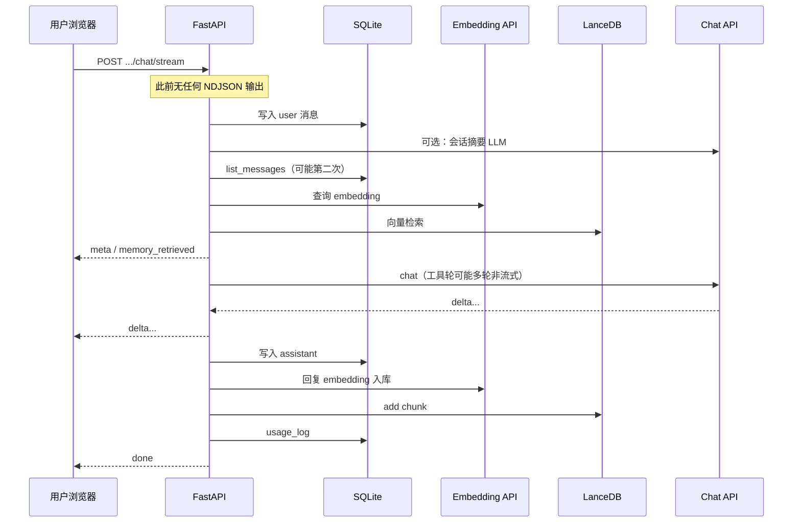

# My_Agent_ 性能瓶颈分析

> 分析日期：2026-05-24  
> 基于当前代码（FastAPI + SQLite + LanceDB + OpenAI 兼容 API）。  
> 目的：帮助后续优化时有优先级，避免在「模型延迟」上过度优化应用层，同时抓住真正拖慢 TTFT / 吞吐的本地瓶颈。

---

## 1. 结论摘要

| 优先级 | 瓶颈域 | 典型影响 |
|--------|--------|----------|
| **P0** | 外部 LLM / Embedding API 延迟与费用 | 占单次对话 **80%～95%**  wall time |
| **P0** | 流式路径「首字前」同步准备工作 | 用户感知 **TTFT** 被 summary + 记忆检索 + DB 阻塞 |
| **P1** | 启用工具时的 **非流式** 多轮 `chat.completions` | 工具轮次期间无 token 输出，TTFT 与总时长显著增加 |
| **P1** | 每轮对话 **1 次 embedding 检索 + 1 次 embedding 写入** | 额外 1～2 次网络 RTT；索引目录时线性放大 |
| **P2** | LanceDB **每次操作新建连接**、列表/取 id **全表扫描** | 记忆条数上千后 API 变慢 |
| **P2** | SQLite **N+1 查询**、单写者、会话消息重复加载 | 侧栏会话列表、长会话上下文准备变慢 |
| **P3** | 鉴权中间件每请求开 DB、`build_client()` 重复创建 | 高 QPS 时可见；个人使用通常可忽略 |

**个人单机场景**：多数时候「换更快模型 / 减少工具轮次 / 关闭摘要或记忆」比改 Lance 连接池更有效。  
**记忆 >5000 条、目录批量索引、多并发** 时：P1～P2 优化收益明显。

---

## 2. 单次流式对话的关键路径



**核心问题**：从请求进入到第一个 `delta`，中间串行执行了 DB、可选摘要 LLM、Embedding、Lance、再进入 Chat。**首字延迟 ≈ 准备阶段 + 模型首 token**，准备阶段目前在流式开始前全部完成（见 `app/main.py` 中 `chat_stream` → `_build_messages_after_user_turn`）。

---

## 3. 分域详细分析

### 3.1 外部模型 API（P0 — 主导项）

**位置**：`app/llm.py`、`app/memory/embeddings.py`、`app/agent.py`、`app/memory/summary.py`

| 调用点 | 触发条件 | 说明 |
|--------|----------|------|
| `complete_chat` / `stream_chat_completion` | 每轮对话 | 主要耗时与 token 数 |
| `embed_text` | 长期记忆开：每问 1 次 + 每答 1 次 | 固定额外 RTT |
| `summarize_text_block` | 会话消息数 > `MEMORY_SUMMARIZE_OVER_MESSAGES` | **额外一整次 Chat**，阻塞在首字之前 |
| `stream_with_tools` 内 `stream=False` | 启用工具且模型返回 `tool_calls` | 每工具轮一次完整等待 |

**现象**：`usage_logs.elapsed_ms` 高但本地 CPU 低，多为模型侧或网络。

**优化方向（按收益）**：

- 摘要改为**异步后台任务**或定时任务（已有 `summarize_sessions` 类型），不要阻塞用户提问路径。
- 记忆写入改为**后台队列**（回复先流式完成，再 embed + Lance）。
- 检索与写入 embedding **批量**（OpenAI 支持 `input: list[str]`）。
- 工具轮次多时可换更小模型做 tool planning，最终回答再用大模型（未实现）。

---

### 3.2 流式体验与 TTFT（P0 / P1）

**位置**：`app/main.py`（`chat_stream`）、`app/agent.py`（`stream_with_tools`）

#### （1）首字前无输出

```python
# chat_stream：gen() 内先 await _build_messages_after_user_turn，再 yield meta
messages, ctx_meta = await _build_messages_after_user_turn(...)
yield await _ndjson_line({"type": "meta", ...})
```

准备阶段包含：写 user 消息、`maybe_compress_session`（可能 LLM）、`list_messages`、`search_memories`（embedding + Lance）。  
**用户在此阶段看不到任何流式事件**（meta 也在准备之后）。

**建议**：先 `yield meta`（仅 session/model）；记忆检索与摘要放后台或并行；或先发 `type: preparing`。

#### （2）工具路径假流式

`stream_with_tools` 在工具循环里使用 **`stream=False`**（`app/agent.py` 约 112～118 行）。只有最后一轮才可能走 `_stream_final_answer`。

若模型在最后一轮直接返回整段 `content`，代码按 **64 字符分块** 模拟 `delta`（约 149～154 行），**并非真实 token 级流式**，TTFT 仍等于整段生成完毕。

**建议**：工具判定轮保持非流式；**最终回答轮**始终 `stream=True` 且不要先等完整 `content` 再切块。

---

### 3.3 长期记忆与 LanceDB（P1 / P2）

**位置**：`app/memory/lance_store.py`、`app/memory/context.py`、`app/memory/indexer.py`

| 问题 | 代码表现 | 何时恶化 |
|------|----------|----------|
| 每次 `_connect()` + `_open_table()` | 增删查搜各调一次 | 每次对话 2～3 次连接开销 |
| `_next_id()` 全表 `to_arrow()` 取 max(id) | 每条写入 O(N) | 记忆条数 > 几千 |
| `_list_sync()` 全表加载再排序 | `GET /api/memory` | 同上 |
| `maybe_build_index_sync` 在 **每次 add** 后检查并 `create_index(replace=True)` | 接近 256 条时单次 add 很慢 | 批量索引 / 密集对话 |
| 检索无 **source / session_id 预过滤** | 全靠向量 Top-K | 数据混杂时质量与性能都不优 |

Lance 已用 ANN，但在 **N < 256** 时无 PQ 索引，仍可行；瓶颈更多在 **连接复用** 与 **全表 id/列表**。

**建议**：

- 进程内 **单例** `lancedb.connect` + 缓存 `Table` 句柄。
- id 改用 **SQLite 序列表** 或 Lance 自增策略，避免全表 scan。
- 列表接口改为 Lance **limit + order** 查询，避免 `to_arrow()` 全量。
- 索引构建：**批量入库后建一次**，不要每条 `add` 触发。
- 检索加 `.where("source = 'chat'")` 等过滤器（按产品需求）。

**SQLite 回退路径**（`MEMORY_BACKEND=sqlite`）：对最近 `MEMORY_SEARCH_POOL`（默认 500）条做 **Python 暴力余弦**，条数再大则 CPU 与内存线性涨（`app/memory/vector.py`）。

---

### 3.4 目录索引（P1）

**位置**：`app/memory/indexer.py`

- 对每个文件切片 **串行**：`read_file` → `embed_text`（单次 API）→ `add_memory_chunk`（Lance 写入 + 可能索引检查）。
- 100 个切片 ≈ **100 次 embedding RTT**，无 batch、无并发上限控制。

**建议**：文件内切片 batch embedding；Lance `table.add(records)` 批量写入；索引最后统一 `create_index`；可选 `asyncio.Semaphore` 限制并发 embed。

---

### 3.5 数据库与 ORM（P2）

**位置**：`app/repo.py`、`app/main.py`、`app/memory/summary.py`、`app/memory/context.py`

| 问题 | 位置 | 说明 |
|------|------|------|
| **N+1** | `list_sessions`：对每个 session `count_messages` | 50 会话 ≈ 51 次查询 |
| **重复加载消息** | `maybe_compress_session` 与 `prepare_chat_context` 各 `list_messages` 一次 | 长会话双倍 IO |
| **eager load 浪费** | `get_session(..., selectinload(messages))` 但上下文又用 `list_messages` | 可能多占内存 |
| **SQLite 单写** | 默认 aiosqlite | 并发写请求排队 |
| **多次短连接** | 流式一轮：prepare commit、assistant commit、usage commit、auth 中间件 | 事务碎片化 |

**建议**：

- `list_sessions` 用一条 `GROUP BY session_id` 聚合。
- `prepare_chat_context` 只加载一次 messages，传给 summary。
- 流式路径合并 assistant + memory + usage 到 **同一事务**（在可接受一致性前提下）。
- 高并发时考虑 Postgres；个人项目可维持 SQLite。

---

### 3.6 鉴权与 HTTP 客户端（P3）

**位置**：`app/auth.py`、`app/llm.py`、`app/tools_exec.py`

- **鉴权**：`AUTH_ENABLED` 时每请求 `get_session_factory()` + 查库；DB Key 还 `commit` 更新 `last_used_at`（约 77～84 行）。
- **OpenAI 客户端**：`build_client()` 每次新建 `AsyncOpenAI`（`app/llm.py`），无连接复用。
- **http_get**：每次 `AsyncClient` 上下文新建（`tools_exec.py`），无全局连接池。

个人低 QPS 影响小；压测或定时任务密集时可见。

---

### 3.7 前端与静态资源（P3）

**位置**：`static/index.html`

- 启动时串行：`config` → `usage` → `sessions` → `memory` → `history`。
- 无缓存；切换会话拉全量 messages。

对本地 localhost 影响通常 <100ms；远程部署 + 鉴权时叠加。

---

## 4. 按使用场景的预期表现

| 场景 | 主要瓶颈 | 粗略预期 |
|------|----------|----------|
| 短对话、关工具、关记忆 | Chat API | TTFT ≈ 网络 + 模型 |
| 开长期记忆 | +1 embed 检索 + Lance；答完 +1 embed 写入 | +200ms～2s（视 API） |
| 长会话触发摘要 | +1 次完整 Chat **在首字前** | 可能 +3～15s |
| 开工具且多轮 tool_calls | 多轮非流式 Chat + 工具 IO | TTFT 与总时长显著增加 |
| 索引整个 `docs/` | N × embedding 串行 | 分钟级，易触发 rate limit |
| 侧栏刷新 50 会话 | N+1 count | 数十 ms～数百 ms |
| 记忆 1 万条 + 列表 API | Lance 全表 arrow | 明显卡顿 |

---

## 5. 优化路线图（建议顺序）

### 第一阶段（低成本、体感明显）

1. **摘要移出请求关键路径**：仅在定时任务或 idle 时压缩；或超阈值时异步摘要，本轮仍用旧摘要。
2. **流式 meta 提前**：进入 `gen()` 先 yield `meta`，再并行做 memory search。
3. **记忆写入异步化**：`after_assistant_reply` 放 `asyncio.create_task` 或队列 worker。
4. **修复 `list_sessions` N+1**。

### 第二阶段（记忆与索引）

5. Lance **连接/table 单例**；id 分配 O(1)。
6. **batch embedding** + 批量 `table.add`；索引仅在 batch 末构建。
7. 检索增加 metadata filter（可选）。

### 第三阶段（Agent 体验）

8. 工具循环：仅 planning 非流式，**最终回答强制 stream**。
9. 共享 `AsyncOpenAI` / `httpx` 客户端（全局 lifespan 注入）。

### 第四阶段（规模与运维）

10. SQLite → Postgres（若多 worker / 高并发）。
11. 分离 embedding 与 chat 的 rate limit / 重试 / 熔断。
12. 多 worker 时定时任务与 Lance 写锁策略（单写者或任务队列）。

---

## 6. 不建议优先做的事

- 过早上 Milvus / 分布式向量库（当前规模 Lance 本地足够）。
- 过度优化 Python 余弦计算（真正瓶颈在 API 与全表 IO）。
- 为个人使用引入 Redis/Kafka（除非已有多 worker 与异步 pipeline 需求）。

---

## 7. 观测与压测建议

当前已有：

- HTTP 中间件总耗时日志（`app/main.py`）。
- 流式 `done.usage`：`elapsed_ms`、`ttft_ms`、token 估算（`app/usage.py`）。
- `usage_logs` 表。

**建议补充**（后续实现时可对照本文档）：

| 指标 | 用途 |
|------|------|
| `prep_ms` | `_build_messages_after_user_turn` 耗时 |
| `embed_search_ms` / `embed_index_ms` | 记忆检索与写入 |
| `lance_ms` | Lance 操作 |
| `summary_ms` | 是否触发摘要 LLM |
| `tool_rounds` | 工具循环次数 |

压测脚本可对 `/api/sessions/{id}/chat/stream` 固定 prompt，对比开关 memory/tools/summary 的 TTFT 与 P95。

---

## 8. 相关代码索引

| 主题 | 主要文件 |
|------|----------|
| 流式对话与 TTFT | `app/main.py` → `chat_stream`, `_build_messages_after_user_turn` |
| 工具多轮 | `app/agent.py` → `stream_with_tools`, `complete_with_tools` |
| 上下文与记忆 | `app/memory/context.py` → `prepare_chat_context` |
| 会话摘要 | `app/memory/summary.py` → `maybe_compress_session` |
| Lance 存储 | `app/memory/lance_store.py` |
| Embedding | `app/memory/embeddings.py` |
| 目录索引 | `app/memory/indexer.py` |
| 会话列表 N+1 | `app/main.py` → `list_sessions` |
| 鉴权 DB | `app/auth.py` → `auth_middleware` |

---

## 9. 与向量库文档的关系

- 选型与原理见 [`vector-databases.md`](./vector-databases.md)。
- Lance 接入说明见 [`development-log.md`](./development-log.md)（2026-05-24 章节）。
- 本文档聚焦 **性能瓶颈与优化优先级**，随代码演进请更新「分析日期」与具体行号。

---

*文档版本：v1.0 · 2026-05-24*
