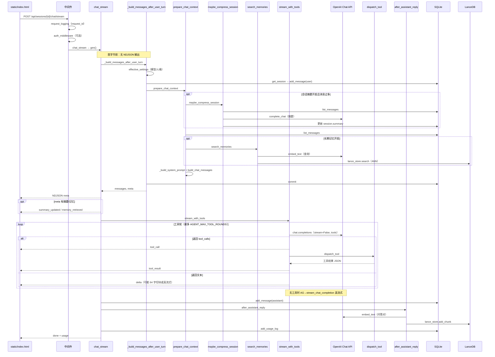
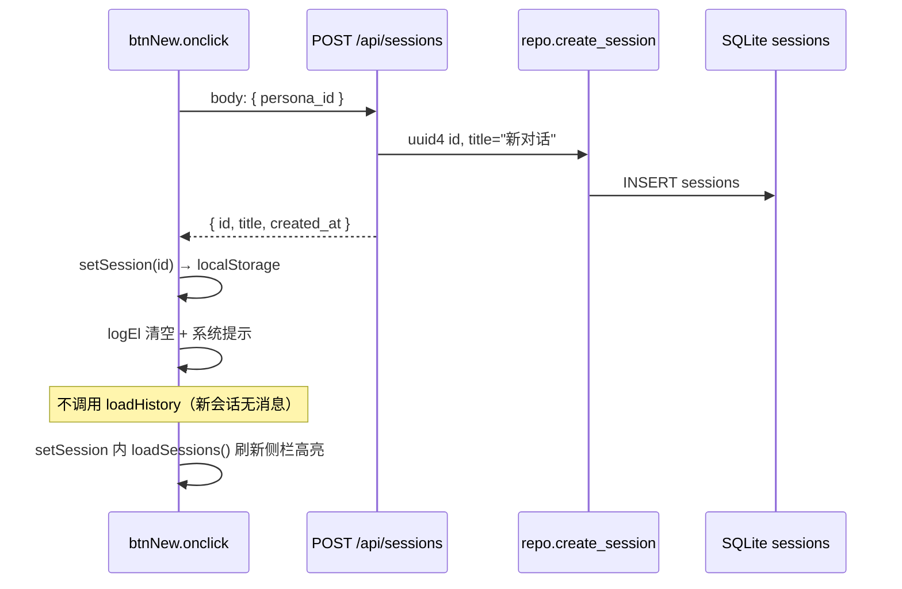
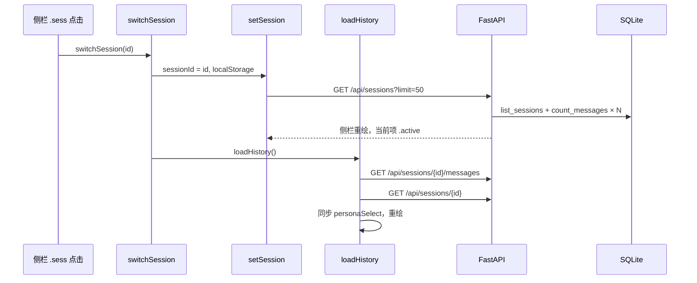
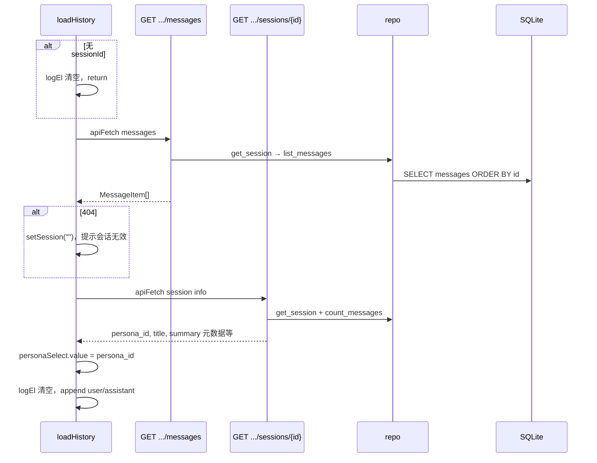
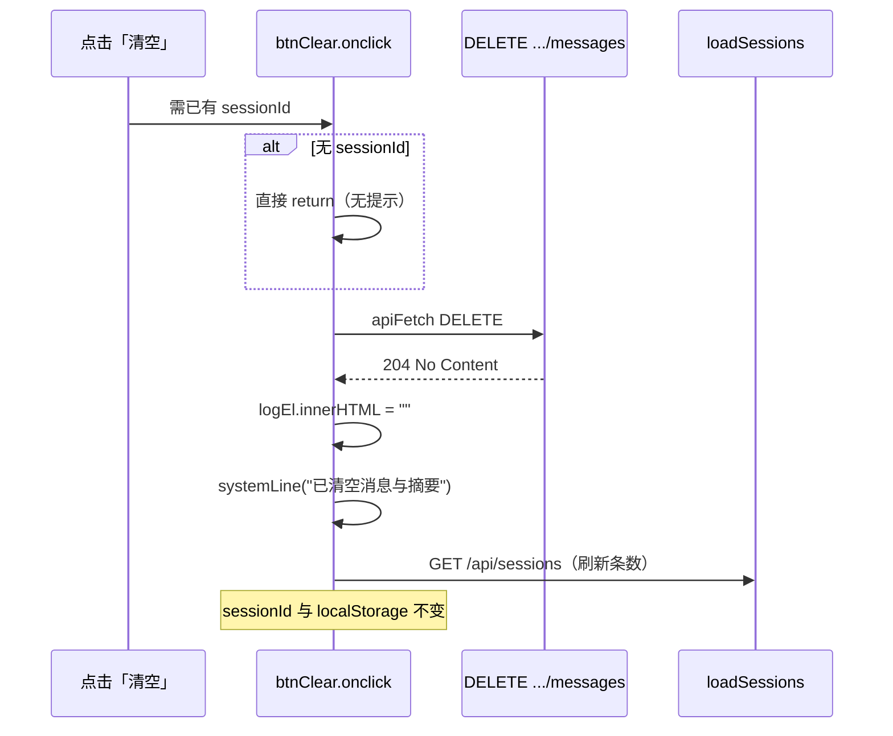
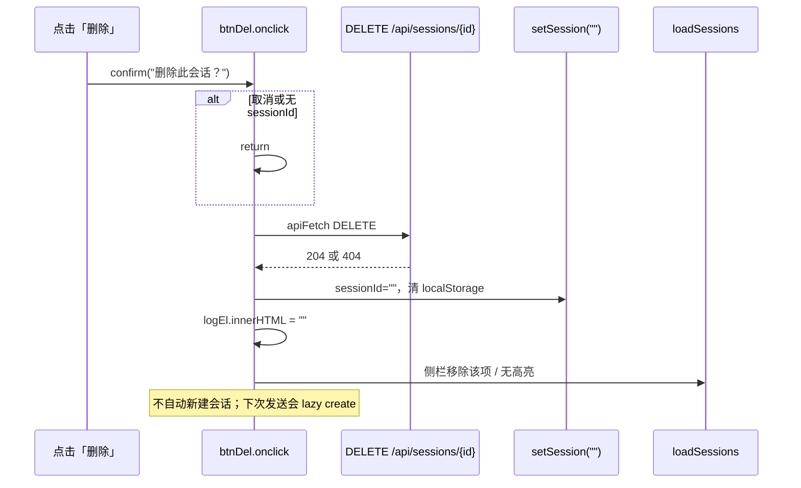
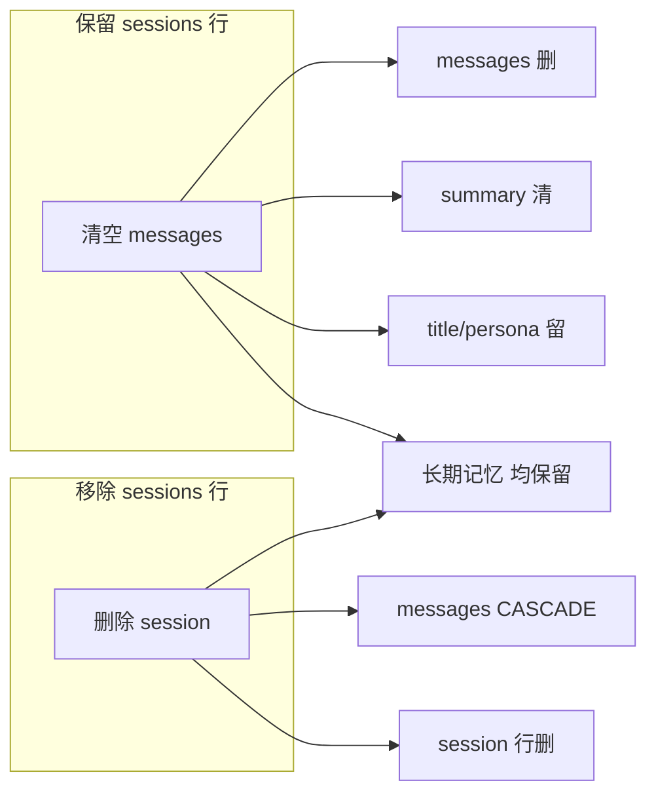
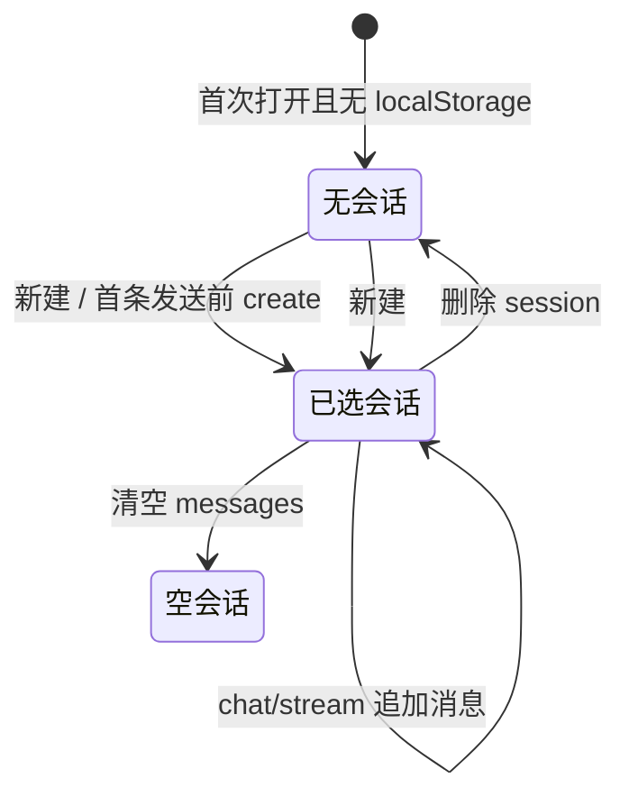
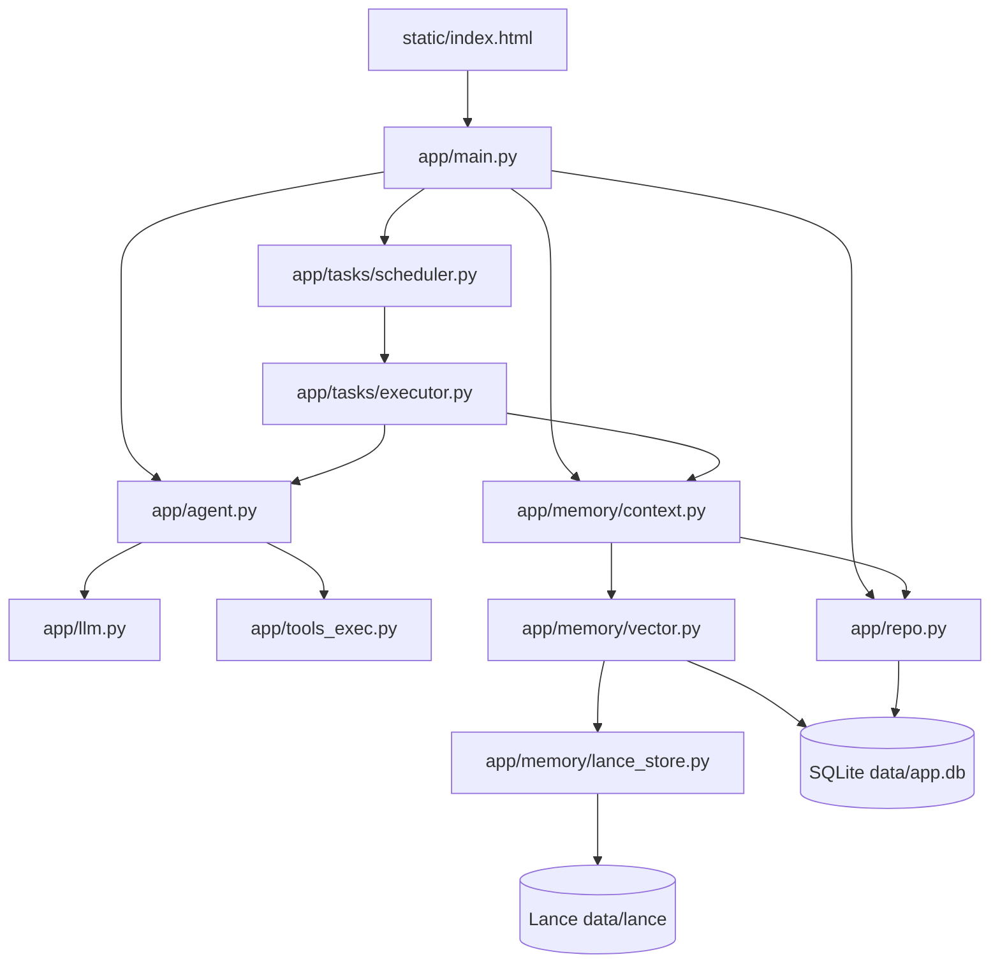

# My_Agent_ 项目文件说明

> 更新日期：2026-05-24  
> 说明仓库内**每个源码与文档文件**的职责，便于新人上手或后续重构时定位代码。  
> 不含 `.venv/`、`.git/`、`__pycache__/` 等生成物与依赖目录。

---

## 1. 目录总览

```
My_Agent_/
├── README.md              # 项目入口说明
├── Makefile               # install / dev 快捷命令
├── Dockerfile             # 容器镜像构建
├── requirements.txt       # Python 依赖锁定
├── .env.example           # 环境变量模板
├── .gitignore             # Git 忽略规则
├── app/                   # 后端应用（FastAPI）
│   ├── main.py            # HTTP 路由、生命周期、流式对话入口
│   ├── config.py          # 环境变量与 Settings
│   ├── db.py              # SQLAlchemy 引擎与会话工厂
│   ├── models.py          # ORM 表定义
│   ├── migrate.py         # SQLite 轻量 schema 迁移
│   ├── repo.py            # 会话 / 消息 / 用量 数据访问
│   ├── schemas.py         # Pydantic 请求与响应模型
│   ├── llm.py             # OpenAI 兼容 Chat / 流式封装
│   ├── agent.py           # 工具多轮对话循环
│   ├── tools_schema.py    # 工具 JSON Schema（给模型）
│   ├── tools_exec.py      # 工具实际执行（读文件、HTTP）
│   ├── request_settings.py# 单次请求覆盖模型等配置
│   ├── personas.py        # 人格模板加载
│   ├── usage.py           # Token 统计与费用估算
│   ├── auth.py            # API Key 鉴权中间件
│   ├── repo_auth.py       # API Key 数据库 CRUD
│   ├── repo_tasks.py      # 定时任务与运行记录 CRUD
│   ├── memory/            # 摘要 + 向量记忆
│   └── tasks/               # APScheduler 调度与执行
├── static/
│   └── index.html         # 单页 Web UI
├── docs/                  # 项目文档
└── data/                  # 运行时数据（gitignore，本地生成）
    ├── app.db             # SQLite 主库
    ├── lance/             # LanceDB 向量数据
    └── personas.json      # 人格定义（可选）
```

---

## 2. 根目录文件

| 文件 | 作用 |
|------|------|
| `README.md` | 项目简介、快速开始、功能表、文档索引、Docker 用法。 |
| `Makefile` | `make install`：创建 venv、安装依赖、复制 `.env.example`；`make dev`：热重载启动 uvicorn。 |
| `Dockerfile` | 基于 Python 3.11-slim 构建镜像，复制 `app/`、`static/`、`data/`，默认 8000 端口运行 uvicorn。 |
| `requirements.txt` | 依赖清单：FastAPI、uvicorn、OpenAI SDK、SQLAlchemy+aiosqlite、httpx、APScheduler、croniter、LanceDB 等。 |
| `.env.example` | 全部可配置项的示例与注释（API、工具白名单、记忆、鉴权、调度、Lance 路径等）。复制为 `.env` 后生效。 |
| `.gitignore` | 忽略 `.env`、`.venv/`、`data/`、`*.db`、`__pycache__/` 等本地与敏感文件。 |
| `.env` | **本地私有配置**（不入库）。实际 API Key 与开关在此设置。 |

---

## 3. 后端 `app/` — 入口与基础设施

### 3.1 应用入口

| 文件 | 作用 |
|------|------|
| `app/__init__.py` | 包标识；模块 docstring。 |
| `app/main.py` | **FastAPI 应用主文件**。负责：<br>• 启动/关闭：`create_all`、SQLite schema 迁移、Lance 从 SQLite 迁移、启动 APScheduler<br>• 中间件：API Key 鉴权、请求耗时日志、CORS<br>• 全部 REST 路由（见下文「API 路由索引」）<br>• 流式对话 `chat/stream`（NDJSON：meta、tool、delta、done）<br>• 静态页 `/` 返回 `static/index.html` |

### 3.2 配置与数据库

| 文件 | 作用 |
|------|------|
| `app/config.py` | `Settings`（pydantic-settings）：从 `.env` 读取 OpenAI、数据库路径、工具白名单、记忆开关、Lance、鉴权、调度等；`get_settings()` 单例；提供 `project_root`、`database_url` 等派生属性。 |
| `app/db.py` | SQLAlchemy `Base`、异步引擎 `get_engine()`、会话工厂 `get_session_factory()`；SQLite 连接时开启外键约束。 |
| `app/models.py` | ORM 模型：`SessionModel`、`MessageModel`、`MemoryChunkModel`（旧版 SQLite 向量）、`ApiKeyModel`、`ScheduledTaskModel`、`TaskRunModel`、`UsageLogModel`。 |
| `app/migrate.py` | 对**已有** SQLite 库执行 `ALTER TABLE` 补列（summary、title、persona_id、updated_at 等）；`create_all` 无法自动改旧表时靠此补齐。 |
| `app/schemas.py` | API 请求/响应的 Pydantic 模型：会话、聊天、记忆、人格、配置、API Key、定时任务、用量统计等。 |

### 3.3 数据访问层（Repository）

| 文件 | 作用 |
|------|------|
| `app/repo.py` | 会话与消息的 CRUD：`create_session`、`list_sessions`、`get_session`、`list_messages`、`add_message`、`touch_session`、删除/清空；`usage_logs` 写入与 `usage_stats_summary` 聚合查询。 |
| `app/repo_auth.py` | API Key 持久化：创建（返回明文一次）、列表、启用/禁用、删除；校验哈希并更新 `last_used_at`。 |
| `app/repo_tasks.py` | 定时任务 CRUD 与运行记录；定义支持的任务类型 `TASK_TYPES`：`index_folder`、`agent_prompt`、`summarize_sessions`。 |

### 3.4 LLM、Agent 与工具

| 文件 | 作用 |
|------|------|
| `app/llm.py` | 构建 `AsyncOpenAI` 客户端；`build_chat_messages` 组装 messages；`stream_chat_completion` / `complete_chat` 封装 Chat Completions API。 |
| `app/agent.py` | **Agent 核心**：`complete_with_tools` / `stream_with_tools` 多轮工具循环（解析 `tool_calls`、调用 `dispatch_tool`、再喂回模型）；`tools_for_request` 按请求决定是否挂载工具。 |
| `app/tools_schema.py` | 根据配置生成 OpenAI Function Calling 格式的工具定义（`read_file`、可选 `http_get`）。 |
| `app/tools_exec.py` | 工具实现与安全边界：`read_file`（路径必须在 `TOOL_FILE_ROOTS` 下）、`http_get`（主机必须在白名单）；`dispatch_tool` 统一入口。 |
| `app/request_settings.py` | `effective_settings()`：单次聊天请求可覆盖 `model`、`persona` 等，返回新的 `Settings` 副本。 |

### 3.5 人格、用量、鉴权

| 文件 | 作用 |
|------|------|
| `app/personas.py` | 从 `data/personas.json` 加载人格列表；`resolve_persona_prompt()` 将会话/请求的 `persona_id` 解析为系统提示片段。 |
| `app/usage.py` | `UsageAccumulator` 累计 prompt/completion tokens；`estimate_cost_usd` 按模型粗算费用；`estimate_tokens_from_text` 无 usage 时的兜底估算。 |
| `app/auth.py` | API Key 鉴权：`auth_middleware` 拦截非公开路径；支持 Header `X-API-Key` 或 `Authorization: Bearer`；环境变量 `API_KEYS` 与数据库哈希密钥二选一或并用。 |
| `app/repo_auth.py` | （见上）鉴权相关的数据库操作。 |

---

## 4. 记忆子系统 `app/memory/`

| 文件 | 作用 |
|------|------|
| `app/memory/__init__.py` | 包说明：会话摘要与长期向量记忆。 |
| `app/memory/context.py` | **对话上下文编排**：`prepare_chat_context()` 在模型调用前组装 system prompt（人格 + 会话摘要 + 检索到的记忆块 + 最近消息）；`after_assistant_reply()` 在回复后写入长期记忆。 |
| `app/memory/summary.py` | 会话滚动摘要：`maybe_compress_session()` 在消息过多时用 LLM 压缩旧对话，更新 `sessions.summary` 与 `summary_up_to_message_id`。 |
| `app/memory/embeddings.py` | 调用 Embedding API（`embed_text`）；向量 JSON 序列化/反序列化；`cosine_similarity`（SQLite 回退路径用）。 |
| `app/memory/types.py` | `MemoryChunkView`：记忆条目的统一视图（id、content、source、session_id、created_at 等），供 API 与 Lance/SQLite 共用。 |
| `app/memory/vector.py` | **向量记忆门面**：根据 `MEMORY_BACKEND` 路由到 Lance 或 SQLite；`add_memory_chunk`、`search_memories`、`list_memory_chunks`、`delete_memory_chunk`。 |
| `app/memory/lance_store.py` | LanceDB 具体实现：连接、建表、写入、ANN 检索、列表/删除、PQ 索引构建；启动时 `migrate_sqlite_to_lance_if_needed()` 从旧表迁移数据。 |
| `app/memory/indexer.py` | 目录批量索引：`index_folder()` 扫描白名单扩展名文件、切片、逐块 embedding 并入库（供 API 与定时任务调用）。 |

**数据流简述**：用户提问 → `prepare_chat_context` 可能摘要 + embedding 检索 → 模型回复 → `after_assistant_reply` embedding 写入 Lance（或 SQLite）。

---

## 5. 定时任务 `app/tasks/`

| 文件 | 作用 |
|------|------|
| `app/tasks/__init__.py` | 包说明。 |
| `app/tasks/scheduler.py` | APScheduler 集成：`start_scheduler` / `shutdown_scheduler`；从数据库加载 cron 任务；`validate_cron` 校验五段表达式；`reload_scheduler_jobs` 在任务变更后刷新。 |
| `app/tasks/executor.py` | 任务执行体：`execute_scheduled_task(task_id)` 写运行记录并调用 `_run_task_body`：<br>• `index_folder`：索引指定目录<br>• `summarize_sessions`：批量压缩会话摘要<br>• `agent_prompt`：在指定或新建会话中自动提问并保存回复 |

---

## 6. 前端 `static/`

| 文件 | 作用 |
|------|------|
| `static/index.html` | **单文件 Web UI**（无构建步骤）：深色主题聊天界面；侧栏多会话；模型/人格/工具/记忆开关；流式解析 NDJSON；记忆列表与删除；用量展示；调用全部 `/api/*` 接口。CSS 与 JavaScript 内联在同一 HTML 中。 |

---

## 7. 文档 `docs/`

| 文件 | 作用 |
|------|------|
| `docs/development-log.md` | 按周记录开发进度、API 清单、决策与已知限制；新功能完成后在此追加章节。 |
| `docs/comparison.md` | 与 ChatGPT/Claude 等云端产品在数据驻留、工具、记忆、成本等方面的对比。 |
| `docs/vector-databases.md` | 向量数据库概念、选型对比、与本项目 LanceDB 集成的说明与 FAQ。 |
| `docs/performance-analysis.md` | 性能瓶颈分析：TTFT、Embedding、Lance、SQLite N+1 等及优化路线图。 |
| `docs/project-files.md` | **本文档**：项目文件职责索引。 |

---

## 8. 运行时目录 `data/`（本地生成，默认不入 Git）

| 路径 | 作用 |
|------|------|
| `data/app.db` | SQLite 主数据库：会话、消息、用量、API Key、定时任务、任务运行记录；旧版 `memory_chunks` 表可能仍存在（Lance 为主后端时作迁移源）。 |
| `data/lance/` | LanceDB 本地目录：长期向量记忆表与索引文件（由 `LANCE_DB_PATH` 配置）。 |
| `data/personas.json` | 人格模板 JSON 数组，每项含 `id`、`name`、`description`、`prompt`；缺失时人格功能为空列表。 |

**示例 `personas.json` 结构**：

```json
[
  {
    "id": "coder",
    "name": "编程助手",
    "description": "简洁、偏代码",
    "prompt": "你是严谨的编程助手..."
  }
]
```

---

## 9. API 路由与 `main.py` 对应关系

| 方法 | 路径 | 主要逻辑位置 |
|------|------|----------------|
| GET | `/health` | 健康检查 |
| GET | `/api/config` | 模型列表、记忆后端、鉴权开关、任务类型等 |
| GET/POST/PATCH/DELETE | `/api/keys` | `repo_auth` + `auth` |
| GET/POST/PATCH/DELETE | `/api/tasks` | `repo_tasks` + `scheduler.reload` |
| POST | `/api/tasks/{id}/run` | `tasks.executor` |
| GET | `/api/tasks/{id}/runs` | `repo_tasks.list_task_runs` |
| GET | `/api/usage/stats` | `repo.usage_stats_summary` |
| GET/POST/PATCH/DELETE | `/api/sessions` | `repo` |
| GET/DELETE | `/api/sessions/{id}/messages` | `repo` |
| GET/DELETE | `/api/memory` | `memory.vector` / `lance_store` |
| POST | `/api/memory/index-folder` | `memory.indexer` |
| POST | `/api/sessions/{id}/chat` | `agent` + `memory.context` |
| POST | `/api/sessions/{id}/chat/stream` | 同上 + NDJSON 流 |
| GET | `/` | 返回 `static/index.html` |

鉴权开启时，除 `/`、`/health`、`/api/config` 外均需有效 API Key。

---

## 10. 典型一次对话的代码调用链

以下以 **Web UI 发起一次流式对话**（`POST /api/sessions/{id}/chat/stream`）为主路径；非流式 `/chat` 与定时任务 `agent_prompt` 在准备与收尾阶段相同，仅模型输出阶段走 `complete_with_tools` 而非 `stream_with_tools`。

### 10.1 端到端时序（流式）



### 10.2 分阶段调用栈

#### 阶段 A：请求进入（`app/main.py` + `app/auth.py`）

| 顺序 | 函数 | 文件 | 说明 |
|------|------|------|------|
| 1 | `apiFetch` → `fetch` | `static/index.html` | 表单提交；无 `sessionId` 时先 `POST /api/sessions` |
| 2 | `request_logging_middleware` | `app/main.py` | 生成/透传 `X-Request-ID`，写访问日志 |
| 3 | `auth_middleware` | `app/auth.py` | `AUTH_ENABLED` 时校验 `X-API-Key` / Bearer；查 env 或 `repo_auth.verify_db_api_key` |
| 4 | `chat_stream` | `app/main.py` | 校验 `OPENAI_API_KEY`；创建 `UsageAccumulator`；返回 `StreamingResponse(gen())` |

#### 阶段 B：准备上下文（首字前，同步阻塞）

| 顺序 | 函数 | 文件 | 说明 |
|------|------|------|------|
| 5 | `_build_messages_after_user_turn` | `app/main.py` | 编排：写 user 消息 → 组装 messages → commit |
| 6 | `effective_settings` | `app/request_settings.py` | 请求级覆盖 `openai_model`；`persona_id` → `resolve_persona_prompt`（`app/personas.py`） |
| 7 | `repo.get_session` | `app/repo.py` | 加载会话（含 ORM relationship） |
| 8 | `repo.add_message(..., "user", ...)` | `app/repo.py` | 持久化用户输入 |
| 9 | `prepare_chat_context` | `app/memory/context.py` | 摘要 → 拉历史 → 向量检索 → 拼 system + messages |

**`prepare_chat_context` 内部：**

| 子步骤 | 函数 | 条件 | 外部依赖 |
|--------|------|------|----------|
| 9a | `maybe_compress_session` | `use_session_summary` 且 `memory_session_summary` | 消息数 > `MEMORY_SUMMARIZE_OVER_MESSAGES` 时调用 `summarize_text_block` → `complete_chat`（`app/llm.py`） |
| 9b | `repo.list_messages` | 始终 | SQLite |
| 9c | `search_memories` | `use_long_term_memory` 且 `memory_long_term` | `embed_text` → `lance_store.search` 或 SQLite 暴力 Top-K |
| 9d | `_build_system_prompt` | 始终 | 合并 `resolved_system_prompt`、会话摘要、记忆块 |
| 9e | `build_chat_messages` | 始终 | `app/llm.py`：system + 最近 N 轮 + 当前 user |

#### 阶段 C：流式生成（NDJSON 输出）

| 顺序 | 函数 | 文件 | 说明 |
|------|------|------|------|
| 10 | `tools_for_request` | `app/agent.py` | `use_tools=false` 则工具列表为空 |
| 11 | `openai_tools_for_settings` | `app/tools_schema.py` | 按白名单注册 `read_file` / `http_get` |
| 12 | `stream_with_tools` | `app/agent.py` | 见下表分支 |
| 13 | `_ndjson_line` | `app/main.py` | 每事件一行 JSON |

**`stream_with_tools` 分支：**

| 条件 | 行为 | 产出 NDJSON |
|------|------|-------------|
| 无工具 | `stream_chat_completion` → `build_client` → Chat API `stream=True` | 连续 `{"type":"delta","text":"..."}` |
| 有工具，模型返回 `tool_calls` | 非流式 Chat；`dispatch_tool` → `tools_exec` | `tool_call` → `tool_result`；循环直至无工具 |
| 有工具，模型直接返回 `content` | 整段文本按 64 字符切块 | 多个 `delta`（非 token 级流式） |
| 有工具，`content` 为空 | `_stream_final_answer`（`tool_choice=none`, `stream=True`） | 真流式 `delta` |

**工具执行链（以 `read_file` 为例）：**

```
dispatch_tool(name, arguments_json, settings)
  → tools_exec.tool_read_file
  → 校验路径在 TOOL_FILE_ROOTS 内
  → 同步读文件（大小上限 TOOL_MAX_FILE_BYTES）
  → 返回 JSON 字符串给模型（role: tool）
```

#### 阶段 D：收尾持久化

| 顺序 | 函数 | 文件 | 说明 |
|------|------|------|------|
| 14 | `repo.add_message(..., "assistant", full)` | `app/repo.py` | 拼接全部 delta 后写入 |
| 15 | `after_assistant_reply` | `app/memory/context.py` | 长期记忆开启时格式化「用户+助手」文本 |
| 16 | `add_memory_chunk` | `app/memory/vector.py` | `embed_text` → `lance_store.add_chunk`（或 SQLite 行） |
| 17 | `_persist_usage` → `repo.add_usage_log` | `app/main.py` / `app/repo.py` | token、耗时、TTFT、估算 USD |
| 18 | `done` 事件 | `app/main.py` | 前端移除 `streaming` 样式并刷新用量 |

**Lance 写入路径（默认 `MEMORY_BACKEND=lance`）：**

```
add_memory_chunk
  → embeddings.embed_text          # OpenAI Embedding API
  → lance_store.add_chunk
  → asyncio.to_thread(_add_chunk_sync)
  → _connect / _open_table / _next_id / table.add
  → maybe_build_index_sync（行数 ≥ MEMORY_LANCE_INDEX_MIN_ROWS 时建 PQ 索引）
```

### 10.3 前端如何消费 NDJSON（`static/index.html`）

| `type` | 前端行为 |
|--------|----------|
| `meta` | 记录 request_id（响应头 `X-Request-ID`） |
| `summary_updated` | 系统行提示摘要字数 |
| `memory_retrieved` | 系统行提示检索条数 |
| `tool_call` / `tool_result` | 系统行展示工具名 |
| `delta` | 追加到当前 `.msg.assistant.streaming` |
| `done` | 展示耗时、token、费用、TTFT；`loadUsage()` |
| `error` | 系统行红色错误 |

首字时间（TTFT）在服务端以**第一个 `delta` 事件**相对请求开始时刻计算（`chat_stream` 内 `first_delta`）。

### 10.4 与非流式 `/chat` 的差异

| 环节 | `/chat/stream` | `/chat` |
|------|----------------|---------|
| 准备上下文 | 相同：`_build_messages_after_user_turn` | 相同 |
| 模型输出 | `stream_with_tools` + NDJSON | `complete_with_tools` 一次返回字符串 |
| 持久化 | 流结束后 `add_message` + `after_assistant_reply` | 相同 |
| 用量 | 含 `ttft_ms` | `ttft_ms=None` |
| 典型调用方 | Web UI | curl / 脚本 / 定时任务 `agent_prompt` |

### 10.5 关键开关如何影响调用链

| 请求/配置 | 跳过的步骤 | 额外步骤 |
|-----------|------------|----------|
| `memory_enabled=false` | 摘要与长期记忆均不执行 | — |
| `use_session_summary=false` | 跳过 `maybe_compress_session` | — |
| `use_long_term_memory=false` | 跳过 `search_memories`、`after_assistant_reply` | — |
| `use_tools=false` | 无 `tool_call` 循环 | 直接 `stream_chat_completion` |
| `AUTH_ENABLED=false` | 鉴权 DB 查询 | — |
| `MEMORY_BACKEND=sqlite` | 无 Lance | `search_memories` 在 SQLite 池内余弦相似度 |

### 10.6 一句话记忆

**用户点发送 → 中间件 → 写 user 消息 →（可选摘要 LLM + embedding 检索）→ 拼 messages → 流式 Chat（可能多轮工具）→ 写 assistant →（可选 embedding 入库 Lance）→ 写用量 → `done`。**

更细的耗时分布见 [`performance-analysis.md`](./performance-analysis.md)。

### 10.7 页面启动与会话状态（前置）

浏览器打开 `/` 后，`static/index.html` 底部 `init()` 串行加载：

```
init()
  → loadConfig()           GET /api/config（公开，无需 Key）
  → loadUsage()            GET /api/usage/stats
  → loadSessions()         GET /api/sessions?limit=50
  → loadMemories()         GET /api/memory?limit=8
  → loadTasks()            GET /api/tasks
  → 若 localStorage 有 sessionId → loadHistory()
```

| 前端变量 / 存储 | 键名 | 作用 |
|-----------------|------|------|
| `sessionId` | `localStorage.my_agent_session_id` | 当前选中会话 UUID；空字符串表示「未选中」 |
| API Key | `localStorage.my_agent_api_key` | 鉴权开启时由 `apiFetch` 注入请求头 |

**注意**：`loadConfig()` 用裸 `fetch`（不走 `apiFetch`），因 `/api/config` 在 `PUBLIC_PATHS` 内；其余会话相关接口在 `AUTH_ENABLED=true` 时需 Key。

---

### 10.8 新建会话

有两种入口，后端均为 **`POST /api/sessions`**，最终都调用 `repo.create_session`。

#### 入口 A：侧栏「新建」按钮



| 步骤 | 位置 | 说明 |
|------|------|------|
| 1 | `#btnNew` onclick | `apiFetch POST`，body 带当前 `personaSelect.value` |
| 2 | `create_session` | `app/main.py` → `SessionCreateRequest` 解析 |
| 3 | `repo.create_session` | 生成 UUID、`title=body.title or "新对话"`、`updated_at=now` |
| 4 | `setSession(j.id)` | 写 `localStorage` + `loadSessions()` 重绘列表 |
| 5 | UI | 清空 `#log`，显示「已创建新会话」 |

#### 入口 B：无会话时首次发送

表单 `onsubmit` 中若 `!sessionId`，先 **`POST /api/sessions`**（body `{}`），再进入 §10 流式对话链：

```
if (!sessionId) {
  POST /api/sessions  →  setSession(cj.id)
}
append("user", text)   // 仅 DOM，尚未写库
POST .../chat/stream   // 服务端 _build_messages_after_user_turn 写 user 消息
```

与「新建」的区别：**不会先清空聊天区**；创建后立即在同一会话里发首条消息；`persona_id` 在 stream 请求体里传递（`touch_session` 可能更新会话人格）。

#### 后端 `create_session` 调用栈

```
POST /api/sessions
  → get_session_factory()
  → repo.create_session(db, title=..., persona_id=...)
       → SessionModel(id=uuid4(), title, persona_id, updated_at)
       → db.add → flush → refresh
  → db.commit()
  → SessionCreateResponse
```

**不涉及**：Lance、LLM、Embedding；仅 SQLite `sessions` 表一行。

---

### 10.9 切换会话

用户点击侧栏某条会话 → `switchSession(id)`。



| 步骤 | 函数 | API | 后端 |
|------|------|-----|------|
| 1 | `switchSession(id)` | — | 编排入口 |
| 2 | `setSession(id)` | `GET /api/sessions` | `list_sessions` → 每条 `count_messages`（N+1） |
| 3 | `loadHistory()` | 见 §10.10 | 拉消息 + 会话元数据 |

**前端状态变化**：

- `sessionId` 与 `localStorage` 更新
- 侧栏按钮 class `active` 切换到对应项
- `#log` 由 `loadHistory` 完全重建（不保留上一会话的 DOM）

**未切换的内容**：模型下拉、工具/摘要/记忆勾选、长期记忆面板、定时任务面板——均为全局 UI 状态，不随会话持久化（仅 `persona_id` 在拉历史时从服务端恢复）。

---

### 10.10 拉历史（`loadHistory`）

切换会话或页面 `init()` 恢复上次会话时调用。

#### 时序



#### 两次 HTTP 请求（串行）

| 顺序 | 方法 | 路径 | 后端 handler | repo | 返回用途 |
|------|------|------|--------------|------|----------|
| 1 | GET | `/api/sessions/{id}/messages` | `get_messages` | `get_session`（404 校验）→ `list_messages` | 按 `id` 升序的全部消息 |
| 2 | GET | `/api/sessions/{id}` | `get_session_info` | `get_session` + `count_messages` | 恢复 `persona_id` 到下拉框 |

#### `list_messages` 后端

```
GET /api/sessions/{session_id}/messages
  → repo.get_session(db, session_id)     # selectinload(messages)，但列表仍单独查
  → repo.list_messages(db, session_id)
       → SELECT * FROM messages WHERE session_id=? ORDER BY id ASC
  → [MessageItem(id, role, content, created_at), ...]
```

#### 前端渲染规则

```javascript
logEl.innerHTML = "";
items.forEach(m => {
  if (m.role === "user") append("user", m.content);
  if (m.role === "assistant") append("assistant", m.content);
});
```

| 渲染 | 说明 |
|------|------|
| 展示 | 仅 `user` / `assistant` 角色 |
| 不展示 | `system`、`tool` 等（若未来入库） |
| 不展示 | 会话 `summary` 字段（摘要只在服务端拼进 Chat context，不进消息表） |
| 不展示 | 流式过程中的 `tool_call` / `memory_retrieved` 等系统行（切换后丢失，除非刷新前未切换） |

#### 与对话链的衔接

| 场景 | 行为 |
|------|------|
| `init()` 有有效 `sessionId` | 自动 `loadHistory()`，刷新后恢复上次会话 |
| 流式 `done` 后 | `loadSessions()` 更新侧栏条数/时间，**不**重新 `loadHistory`（避免覆盖正在显示的 streaming DOM） |
| 会话 404 | 清空 `sessionId`，提示「会话无效」（库被删或 id 过期） |

清空与删除的完整调用链见 **§10.11 / §10.12**。

#### 性能提示

- `loadHistory` 每次切换 **2 次** API；消息很多时 `#log` 全量 DOM 重建可能卡顿。
- `GET /api/sessions` 列表存在 **N+1** `count_messages`（见 [`performance-analysis.md`](./performance-analysis.md)）。
- `get_session` 的 `selectinload(messages)` 在 `get_messages` 路径上**未被使用**（消息由 `list_messages` 再查一次）。

---

### 10.11 清空会话

侧栏 **「清空」**（`#btnClear`）：保留会话记录，仅删除该会话下全部消息并重置滚动摘要。适合「同一会话 id 下从头聊」，侧栏标题与人格通常保留。

#### 前端调用链



| 步骤 | 代码位置 | 说明 |
|------|----------|------|
| 1 | `if (!sessionId) return` | 未选中会话时按钮无效（静默） |
| 2 | `DELETE /api/sessions/{id}/messages` | 无确认框 |
| 3 | 清空 `#log` | 仅前端 DOM，不重新请求 messages |
| 4 | `loadSessions()` | 侧栏 `message_count` 变为 0 |
| **不执行** | `loadHistory()` | 聊天区已手动清空 |
| **不执行** | `setSession` | 当前会话 id 保持不变 |

#### 后端调用链

```
DELETE /api/sessions/{session_id}/messages
  → auth_middleware（可选）
  → clear_messages                    app/main.py
  → repo.get_session                  404 校验
  → repo.clear_messages               app/repo.py
       → count_messages（统计删除前条数，返回值未暴露给 API）
       → DELETE FROM messages WHERE session_id = ?
       → UPDATE sessions SET summary = NULL, summary_up_to_message_id = NULL
  → db.commit()
  → Response 204
```

#### 数据库与关联数据

| 对象 | 清空后状态 |
|------|------------|
| `sessions` 行 | **保留**（id、title、persona_id、created_at、updated_at 均不变） |
| `messages` | **全部删除** |
| `sessions.summary` | **置 NULL**（下次对话会重新积累摘要） |
| `usage_logs` | **保留**（`session_id` 仍指向该会话的历史用量） |
| Lance / SQLite **长期记忆** | **不删除**（`source=chat` 且带 `session_id` 的向量块仍在） |
| `memory_chunks`（旧 SQLite 向量表） | **不删除** |

**语义**：清空 = 重置「对话 transcript + 会话内摘要」；**不等于**抹除长期记忆或用量统计。若需删记忆条目，用侧栏记忆面板的「删」或 `DELETE /api/memory/{id}`。

#### 与后续对话的衔接

清空后用户在同一 `sessionId` 下发送消息时，走 §10 正常 `chat/stream` 链：`prepare_chat_context` 读到空历史、无 summary，等价于新会话的模型上下文，但 **session 元数据（标题等）仍沿用旧值**（除非首条 user 消息触发 `touch_session` 改标题逻辑——当前仅在 `title` 为空时才会用首条消息填标题，已有标题则不变）。

---

### 10.12 删除会话

侧栏 **「删除」**（`#btnDel`）：从数据库移除整个会话及其消息，并取消前端选中状态。

#### 前端调用链



| 步骤 | 代码位置 | 说明 |
|------|----------|------|
| 1 | `confirm(...)` | 唯一需用户确认 destructive 操作 |
| 2 | `DELETE /api/sessions/{session_id}` | |
| 3 | `setSession("")` | 清空 `localStorage.my_agent_session_id` 并 `loadSessions()` |
| 4 | 清空 `#log` | |
| **不执行** | 自动 `POST /api/sessions` | 删除后处于「无选中会话」直到用户新建或发消息 |

**与清空的对比（前端）**：

| | 清空 | 删除 |
|---|------|------|
| 确认框 | 无 | 有 |
| `sessionId` | 不变 | 置空 |
| `localStorage` | 不变 | 清除 |
| 侧栏该项 | 仍在，条数 0 | 消失 |

#### 后端调用链

```
DELETE /api/sessions/{session_id}
  → delete_session                     app/main.py
  → repo.delete_session                app/repo.py
       → get_session（存在性检查）
       → DELETE FROM sessions WHERE id = ?
  → db.commit()
  → 404 if not ok else 204
```

#### 级联与残留

| 对象 | 删除会话后 |
|------|------------|
| `messages` | **级联删除**（`ForeignKey(..., ondelete="CASCADE")`） |
| `sessions` | **行删除** |
| `usage_logs` | **保留**（`session_id` 无外键，成为悬空引用） |
| Lance 长期记忆 | **保留**（`session_id` 字段无 FK；检索仍可能命中旧会话内容） |
| `memory_chunks`（SQLite 回退） | **保留**（同上） |
| 定时任务 `agent_prompt` 若 payload 含该 `session_id` | **不受影响**（下次执行可能 404） |

**语义**：删除 = 移除会话壳与全部消息；**不会**清理向量库中已索引的 chat 记忆，也不会删 `usage_logs`。这是当前实现的有意取舍（长期记忆跨会话、用量审计保留）。

#### 错误处理

| HTTP | 原因 | 前端现状 |
|------|------|----------|
| 404 | `session_id` 不存在 | `apiFetch` 不弹窗；DOM 仍被清空、`setSession("")` 仍执行 |
| 401 | 鉴权失败 | 顶部系统行提示配置 Key |

---

### 10.13 清空 vs 删除（对照）



| 维度 | 清空 `DELETE .../messages` | 删除 `DELETE .../sessions/{id}` |
|------|---------------------------|----------------------------------|
| API | `clear_messages` | `delete_session` |
| 会话 id | 不变 | 记录消失 |
| 侧栏条目 | 保留（0 条） | 消失 |
| localStorage | 不变 | 清空 |
| 会话摘要 | 重置 | 随 session 删除 |
| 标题 / 人格 | 保留 | 随 session 删除 |
| 长期记忆 | 不删 | 不删 |
| 用量日志 | 保留 | 保留（悬空 session_id） |
| 典型用途 | 同一会话重来 | 彻底去掉该对话 |

---

### 10.14 会话生命周期总览



| 用户操作 | 主要 API | 主要表 |
|----------|----------|--------|
| 新建 | `POST /api/sessions` | `sessions` INSERT |
| 切换 | `GET /api/sessions` + `GET .../messages` + `GET .../{id}` | `sessions`、`messages` SELECT |
| 拉历史 | 同上 | 同上 |
| 发消息 | `POST .../chat/stream` | `messages` INSERT ×2，`sessions.updated_at` |
| 清空 | `DELETE .../messages` | `messages` DELETE；`summary` 清空；见 §10.11 |
| 删除 | `DELETE /api/sessions/{id}` | `sessions` DELETE CASCADE → `messages`；见 §10.12 |

---

## 11. 模块依赖关系（简图）



---

## 12. 按「想改什么」快速找文件

| 想改… | 优先打开 |
|--------|----------|
| 新增 HTTP 接口 | `app/main.py`、`app/schemas.py` |
| 改环境变量默认值 | `app/config.py`、`.env.example` |
| 改数据库表结构 | `app/models.py`、`app/migrate.py` |
| 改聊天 / 流式行为 | `app/main.py`、`app/agent.py`、`app/llm.py` |
| 新增或限制工具 | `app/tools_schema.py`、`app/tools_exec.py` |
| 改记忆检索 / 入库 | `app/memory/context.py`、`app/memory/vector.py`、`app/memory/lance_store.py` |
| 改会话摘要策略 | `app/memory/summary.py` |
| 改目录索引规则 | `app/memory/indexer.py`、`app/config.py` |
| 改 API Key 逻辑 | `app/auth.py`、`app/repo_auth.py` |
| 改定时任务类型 | `app/repo_tasks.py`、`app/tasks/executor.py`、`app/tasks/scheduler.py` |
| 改 Web 界面 | `static/index.html` |
| 改部署方式 | `Makefile`、`Dockerfile` |

---

## 13. 未单独成文件的约定

- **无 `tests/` 目录**：当前仓库以手动 / curl 验证为主。
- **无前端工程化**：无 `package.json`、无 React/Vue 构建链。
- **无 Alembic**：SQLite 结构演进靠 `migrate.py` 手写 ALTER。
- **日志**：使用标准库 `logging`，logger 名一般为 `my_agent`。

---

*文档版本：v1.3 · 随目录变更请同步更新第 1 节目录树与第 10 节调用链。*
