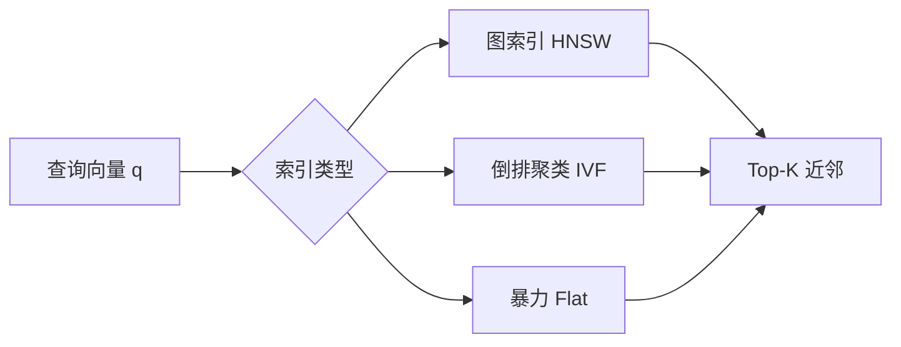

# 向量库（Vector Database）入门与选型指南

> 面向 My_Agent_ 及类似「个人 Agent + 长期记忆 / RAG」场景。  
> 当前项目第三周起使用 **SQLite + JSON 存 embedding + 内存余弦相似度**；本文说明为何需要向量库、原理是什么、以及何时升级到 LanceDB 等专用方案。

---

## 1. 为什么需要向量库？

### 1.1 问题：文本无法直接「算相似」

传统数据库擅长：

- 精确匹配：`WHERE title = '开发记录'`
- 范围与排序：`WHERE created_at > ... ORDER BY id`

但用户常问的是**语义相近**的问题，例如：

- 「我们之前聊过摘要压缩吗？」
- 「和鉴权相关的开发决策有哪些？」

这些问题很难用 SQL `LIKE '%摘要%'` 稳定命中（同义词、换说法、跨语言都会漏检）。

### 1.2 思路：先把文本变成向量，再算「距离」

流程可以概括为：

```text
原文 → Embedding 模型 → 固定长度浮点向量 → 在向量空间里找「最近邻」
```

若两段文本**语义相近**，其向量在空间中通常**距离更近**（常用余弦相似度或欧氏距离衡量）。

**向量库**就是专门存储向量、并高效执行 **相似度检索（Similarity Search / ANN）** 的系统（或模块）。

### 1.3 与 My_Agent_ 的关系

| 阶段 | 实现 | 适用规模 |
|------|------|----------|
| 第三周 MVP | `memory_chunks.embedding_json` + 加载最近 N 条做全量相似度 | 数百～数千条 |
| 升级方向 | LanceDB / pgvector / Qdrant 等 | 万～百万级、要持久索引与过滤 |

个人 Agent 早期用 SQLite 完全合理；当记忆条目、文档切片数量上来后，**建索引 + 近似最近邻（ANN）** 才会成为刚需。

---

## 2. 核心概念与原理

### 2.1 Embedding（嵌入）

- **输入**：一段文本（或图片、音频等，本文以文本为主）。
- **输出**：维度固定的向量，例如 `text-embedding-3-small` 常见为 **1536 维**。
- **性质**：语义相近的文本，向量方向更接近（很多模型会做归一化，此时余弦相似度 ≈ 点积）。

My_Agent_ 当前通过 OpenAI 兼容 API 调用 embedding，与对话模型是**分开计费**的。

### 2.2 相似度度量

| 度量 | 含义 | 常见场景 |
|------|------|----------|
| **余弦相似度** | 两向量夹角，忽略长度 | 文本 embedding（尤其已归一化） |
| **欧氏距离（L2）** | 空间直线距离 | 图像、部分多模态向量 |
| **内积（IP）** | 向量点积 | 归一化后等价于余弦 |

项目里 `app/memory/embeddings.py` 的 `cosine_similarity` 即最直观的实现；数据量大时，这一步会由向量库的 **索引结构** 加速，而不是对每条 brute-force。

### 2.3 精确检索 vs 近似最近邻（ANN）

- **精确（Flat / Brute-force）**：与每一条向量算相似度，取 Top-K。  
  - 优点：结果准确。  
  - 缺点：O(N)，N 大时慢。

- **近似（ANN, Approximate Nearest Neighbor）**：用索引结构「大概率找到最近邻」，牺牲极少精度换数量级速度。  
  - 常见索引：**HNSW**、**IVF**、**PQ**（可组合）。

个人项目 N < 几千时，brute-force 往往够用；RAG 知识库、全仓库代码索引通常需要 ANN。

### 2.4 常见索引结构（了解即可）



- **HNSW（Hierarchical NSW）**：多层小世界图，查询快、召回高，内存占用相对大；**LanceDB、Qdrant、Milvus、Weaviate** 等常用。
- **IVF（Inverted File）**：先聚类，再在少数簇内搜；适合超大规模，参数需调。
- **PQ（Product Quantization）**：压缩向量，省内存，精度略降。

### 2.5 向量库还管什么？

除「存向量 + 搜 Top-K」外，成熟产品通常还提供：

| 能力 | 说明 |
|------|------|
| **元数据过滤** | 先 `source=folder` 再向量搜，避免全库扫描 |
| **持久化与 WAL** | 重启不丢索引 |
| **增量写入** | 新文档切片随时入库 |
| **混合检索** | 向量 + BM25 关键词（Hybrid Search） |
| **多租户 / 命名空间** | 按用户、项目隔离 |
| **版本与删除** | 按 id 删、按来源批量失效 |

My_Agent_ 的 SQLite 方案目前只有「全局检索 + 简单 source 字段」，没有 ANN 与混合检索。

---

## 3. 在 Agent / RAG 中的典型用法

### 3.1 长期记忆（My_Agent_ 第三周）

每轮对话结束写入：

```text
用户：…
助手：…
```

检索时用**当前用户问题**的 embedding 找 Top-K 条，注入 system prompt 的「相关长期记忆」区块。

### 3.2 知识库 RAG（第四周 `index_folder`）

将 `docs/` 下 markdown 按块切片 → embedding → 入库。  
提问时检索相关块，减少「让模型凭空猜文档内容」。

### 3.3 进阶：Hybrid + Rerank

1. **向量召回** Top-50  
2. **BM25** 召回 Top-50  
3. 合并去重  
4. **Cross-Encoder Rerank** 取 Top-5  

这是生产 RAG 常见套路；个人项目可先做向量 Top-K，效果不够再加关键词或 rerank。

---

## 4. 主流向量库对比

下面按**部署形态**与**适用场景**归纳，非严格性能排名（随版本与数据规模变化很大）。

### 4.1 总览表

| 产品 | 类型 | 部署 | 索引/ANN | 元数据过滤 | 混合检索 | 适合谁 |
|------|------|------|----------|------------|----------|--------|
| **SQLite + 自算**（当前） | 关系库 + JSON | 嵌入式 | 无（暴力） | SQL | 需自写 | 原型、<5k 向量 |
| **LanceDB** | 向量原生 | 嵌入式 / 本地文件 | HNSW 等 | 强 | 支持（含 FTS 路线） | **本地 Agent、Serverless、Python 友好** |
| **Chroma** | 向量原生 | 嵌入式 / 服务 | 多种 | 有 | 部分版本支持 | 快速原型、LangChain 生态 |
| **pgvector** | PostgreSQL 扩展 | 自建 PG | IVFFlat / HNSW | SQL 全能力 | 可 + tsvector | 已有 PG、要事务与 JOIN |
| **Qdrant** | 专用向量库 | 自建 / 云 | HNSW | 强 | 有 | 生产服务、过滤复杂 |
| **Milvus** | 专用向量库 | 分布式 | 多种 | 强 | 有 | 大规模、集群 |
| **Weaviate** | 专用向量库 | 自建 / 云 | HNSW | 强 | **内置 BM25 混合** | GraphQL、混合检索 |
| **Pinecone** | 全托管 SaaS | 仅云 | 托管 | 有 | 有 | 免运维、接受厂商锁定 |
| **FAISS** | 算法库 | 进程内 | 多种 | 无（需自管） | 无 | 研究、离线批检索 |

### 4.2 LanceDB

- **特点**：基于 **Lance** 列式存储，**嵌入式**为主（`pip install lancedb`），数据落盘为本地目录，无需单独起服务。
- **优势**：
  - 与 Python / 个人 Agent **同进程**集成简单；
  - 支持 **SQL-like 过滤 + 向量搜索**；
  - 适合从「SQLite 暴力搜」**平滑迁移**；
  - 对 Serverless、笔记本本地运行友好。
- **注意**：生态比 Milvus/Qdrant 小；超大规模集群场景通常选专用分布式方案。

**与 My_Agent_ 的契合点**：继续本地优先、单用户、希望 `data/` 下多一个 `lance/` 目录即可备份。

### 4.3 Chroma

- **特点**：API 简单，教程多，常与 LangChain/LlamaIndex 一起出现。
- **优势**：上手极快；嵌入式模式适合 demo。
- **注意**：长期自用需关注版本升级与数据格式；生产大规模案例相对少。

### 4.4 pgvector

- **特点**：在 **PostgreSQL** 里加向量列与索引。
- **优势**：
  - 会话、用户、用量、向量**同一库**，事务一致；
  - 复杂查询（JOIN、权限）最灵活。
- **注意**：要维护 PG；嵌入式/单机轻量场景不如 LanceDB/Chroma 省事。

### 4.5 Qdrant

- **特点**：Rust 实现，**过滤 + 向量**性能好，REST/gRPC API 清晰。
- **优势**：自托管生产常见；云版可选。
- **注意**：需独立进程/Docker；个人小项目略重。

### 4.6 Milvus

- **特点**：面向**大规模**向量，组件多（etcd、MinIO 等可选）。
- **优势**：亿级向量、分布式。
- **注意**：个人 Agent **过重**；除非明确要上集群。

### 4.7 Weaviate

- **特点**：内置 **向量 + 关键词** 混合检索，带 GraphQL。
- **优势**：RAG 开箱能力多。
- **注意**：部署与学习曲线高于 LanceDB。

### 4.8 Pinecone

- **特点**：全托管，按量付费。
- **优势**：零运维、扩展省心。
- **注意**：数据在第三方；与 My_Agent_「数据主权 / 本地优先」定位不完全一致。

### 4.9 FAISS（Facebook AI Similarity Search）

- **特点**：**库**而非完整数据库；索引在内存（或自管文件）。
- **优势**：性能强、算法全，适合离线建索引。
- **注意**：元数据、持久化、并发 API 都要自己搭——更像引擎而非产品。

---

## 5. 选型建议（按场景）

### 5.1 个人 Agent / My_Agent_ 演进路径

```text
SQLite JSON + brute-force（现在）
        ↓ 记忆/文档 > 5k 或检索变慢
LanceDB 本地目录（推荐下一步）
        ↓ 要多服务、复杂权限、与业务表强一致
PostgreSQL + pgvector
        ↓ 百万级以上、多租户 SaaS
Qdrant / Milvus + 专用检索服务
```

### 5.2 快速决策树

1. **必须全本地、单进程、Python** → **LanceDB** 或 **Chroma**  
2. **已有 Postgres** → **pgvector**  
3. **要混合检索且愿跑服务** → **Weaviate** 或 **Qdrant**  
4. **不想运维、可接受云端** → **Pinecone**  
5. **仅做实验、N 很小** → **继续 SQLite / NumPy brute-force** 即可  

### 5.3 与「对话数据库」如何分工？

| 数据 | 建议存放 |
|------|----------|
| 会话、消息、用量、API Key、定时任务 | SQLite（现状）或 Postgres |
| 记忆切片、文档 embedding | LanceDB 表 / pgvector 表 |
| 关联方式 | `memory_chunks.lance_id` 或 `chunk_uid` 外键式引用 |

不必把所有表迁进向量库；**向量库专注「相似度检索」**，关系型库专注「事务与结构化业务」。

---

## 6. My_Agent_ 已接入 LanceDB（2026-05-24）

当前默认配置：

```env
MEMORY_BACKEND=lance
LANCE_DB_PATH=data/lance
```

| 层 | 职责 |
|----|------|
| SQLite | 会话、消息、用量、API Key、定时任务 |
| LanceDB | 长期记忆向量 + 元数据（content / source / session_id） |

实现入口：`app/memory/lance_store.py`；对外 API 不变（`/api/memory` 等）。

回退旧行为：`.env` 设 `MEMORY_BACKEND=sqlite`。

---

## 7. 迁移到 LanceDB 时会发生什么？（历史说明，已完成）

若 My_Agent_ 后续接入 LanceDB，典型改动是：

**（已完成，见第 6 节。）** 曾规划步骤：

1. **存储**：`embedding_json` → Lance 表列（固定 dim float 数组）。
2. **检索**：`search_memories()` 内 `SELECT ... ORDER BY vector LIMIT k` 改为 `table.search(q_vec).limit(k).where("source = ...")`。
3. **索引**：数据量上来后 `create_index("vector", index_type="IVF_PQ" / "HNSW")`（以 LanceDB 文档为准）。
4. **兼容**：保留 `GET /api/memory` 等 API，仅替换 `app/memory/vector.py` 实现。

Embedding 模型与「何时写入记忆」的逻辑**不必改**。

---

## 7. 常见问题

**Q：向量库等于 Embedding 模型吗？**  
A：否。模型负责「文本→向量」；向量库负责「存向量 + 快搜」。二者配合使用。

**Q：Top-K 设多少？**  
A：个人 Agent 常见 **3～10**；太大噪声多、占 context；太小易漏。My_Agent_ 默认 `MEMORY_RETRIEVE_TOP_K=5`。

**Q：相似度阈值要不要？**  
A：要。低于阈值的结果不注入 prompt（项目里 `MEMORY_MIN_SCORE`），减少「硬凑相关记忆」。

**Q：Embedding 模型换了怎么办？**  
A：旧向量与新向量**不可混比**，需**全量 re-embed** 或分 collection 版本管理。

**Q：LanceDB 和 SQLite 能并存吗？**  
A：可以。会话仍 SQLite；向量表 LanceDB；通过 id 逻辑关联即可。

---

## 8. 延伸阅读

- [LanceDB 官方文档](https://lancedb.github.io/lancedb/)
- [pgvector GitHub](https://github.com/pgvector/pgvector)
- [Qdrant 文档](https://qdrant.tech/documentation/)
- [OpenAI Embeddings 指南](https://platform.openai.com/docs/guides/embeddings)
- 本项目实现：`app/memory/vector.py`、`app/memory/embeddings.py`  
- 开发记录：`docs/development-log.md`（第三周 长期记忆）

---

*文档版本：2026-05-23 · 随 My_Agent_ 向量后端演进可追加「LanceDB 接入实录」章节。*
